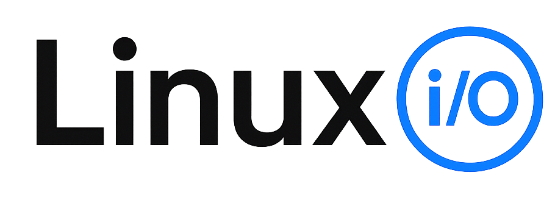

<div align="center">

[](https://github.com/mordilloSan/LinuxIO/releases/latest)
[](https://github.com/mordilloSan/LinuxIO/actions/workflows/github-code-scanning/codeql)
[](LICENSE)
[](backend/go.mod)
[](frontend/package.json)
[](README.md)

<h1>Linux </h1>

A modern web dashboard to manage your Linux system: Docker, WireGuard, updates, users, shares, sensors, and more, from one unified interface.

</div>

---
## Philosophy

Linux I/O is built around a simple idea: your homelab should have a single control plane.

Its primary inspiration is [Cockpit](https://cockpit-project.org/): one place to operate Linux systems end to end.

This project also draws inspiration from many projects across the homelab ecosystem, including [FileBrowser Quantum](https://github.com/gtsteffaniak/filebrowser), [Portainer](https://www.portainer.io/), [Homepage](https://gethomepage.dev/), [Unraid](https://unraid.net/), and many others.

The file-management experience and visual style are intentionally very closely inspired by FileBrowser Quantum, and that influence is explicitly acknowledged.

Linux I/O combines workflows usually split across multiple tools:

- **System administration** (users, networking, updates, sensors)
- **Container operations** (Portainer-style Docker management)
- **Secure remote access** (WireGuard configuration)
- **File operations** (FileBrowser Quantum-style management)

**Goal:** One tool to rule them all: one login, one dashboard, one workflow for your Linux stack.

---

## Features

- **PAM Authentication** - Login with your Linux credentials
- **Live System Stats** - CPU, memory, disk, and network monitoring
- **Docker Manager** - Container management
- **WireGuard UI** - VPN configuration
- **File Explorer** - Integrated file explorer
- **User Accounts** - User management
- **Share Manager** - Samba/NFS shares
- **NetworkManager** - Network configuration
- **Software Updates** - PackageKit integration
- **Hardware Sensors** - `lm-sensors` and SMART monitoring
- **Terminal** - Web-based command execution

---

## Installation

LinuxIO supports Linux kernels 5.9+.

### Quick install (recommended)

**Step 1** — Install dependencies (interactive, prompts for optional extras):
```bash
curl -fsSL https://raw.githubusercontent.com/mordilloSan/LinuxIO/main/packaging/scripts/install-dependencies.sh | sudo bash
```

To install everything without prompts, pass `--all`:
```bash
curl -fsSL https://raw.githubusercontent.com/mordilloSan/LinuxIO/main/packaging/scripts/install-dependencies.sh | sudo bash -s -- --all
```

**Step 2** — Install LinuxIO binaries:
```bash
curl -fsSL https://raw.githubusercontent.com/mordilloSan/LinuxIO/main/packaging/scripts/install-linuxio-binaries.sh | sudo bash
```

Access the dashboard at `https://localhost:8090`. If Avahi is installed (offered during dependency setup), you can also reach the box from any LAN device at `https://<your-hostname>.local:8090`.

On first startup, LinuxIO creates a managed self-signed certificate in
`/var/lib/linuxio/webserver/certificates`. It covers localhost, the system
hostname, `<hostname>.local`, and the host's current IP addresses. The same
certificate is reused across restarts, reboots, and updates until it enters its
30-day renewal window.

<details>
<summary><strong>What gets installed?</strong></summary>

| Category | Packages | Required |
|----------|----------|----------|
| PAM, PolicyKit, PackageKit | Auth, authorization, system updates | Mandatory |
| lm-sensors | Hardware temperature/voltage monitoring | Optional |
| smartmontools | Disk SMART health data | Optional |
| NFS utilities | Mount/browse and export NFS shares (`nfs-common` + `nfs-kernel-server` on Debian/Ubuntu, `nfs-utils` on Fedora/RHEL) | Optional |
| Docker | Container management | Optional |
| Avahi (mDNS) | Reach this host at `<hostname>.local` from other LAN devices | Optional |

</details>

---

## Development

See the [development guide](docs/development.md) for setup requirements,
supported targets, and configurable overrides.

---

## Tech Stack

### Frontend

- **React 19.2.4** with TypeScript
- **Vite** for fast builds
- **Material-UI** (Mira theme)
- **TanStack Query** for data fetching

### Backend

- **Go 1.27**
- **Gorilla WebSocket**
- **PAM** authentication

### Architecture

- **Main Server**: Handles HTTP/HTTPS and WebSocket connections
- **Bridge Process**: Per-user privileged operations with security isolation

---

## Security

- PAM-based authentication
- Session-based auth with secure cookies
- Socket-activated auth worker (no setuid)
- Isolated bridge processes per user
- Persistent managed TLS certificate with a private systemd state directory

See [SECURITY.md](SECURITY.md) for details.

---

## Project Structure

```
LinuxIO/
|- backend/          # Go backend (HTTP + WebSocket)
|- frontend/         # React frontend (Vite + TypeScript)
|- packaging/        # Installation scripts and helpers
|- .github/          # CI/CD workflows
|- Makefile          # Build automation
`- README.md         # This file
```

---

## Contributing

Contributions welcome! Please read our [Contributing Guide](CONTRIBUTING.md) first.

Use [conventional commits](https://www.conventionalcommits.org/) for pull requests:

```bash
feat(docker): add container restart functionality
fix(auth): resolve session timeout issue
docs(readme): update installation instructions
```

---

## License

This project is licensed under the [GNU General Public License v2.0](LICENSE).

---

## Acknowledgments

- [Cockpit](https://cockpit-project.org/) - Primary product inspiration and unified Linux operations model
- [Arcane](https://github.com/getarcaneapp/arcane) - UI and interaction inspiration
- [FileBrowser Quantum](https://github.com/gtsteffaniak/filebrowser) - Strong inspiration for file-management UX and visual style
- [Unraid](https://unraid.net/) - Product and homelab management inspiration
- [Mira Theme](https://mira.bootlab.io) - UI design
- Many other open source and self-hosted projects that shaped LinuxIO's direction

---

## Support

- [Wiki](https://github.com/mordilloSan/LinuxIO/wiki)
- [Issue Tracker](https://github.com/mordilloSan/LinuxIO/issues)
- [Discussions](https://github.com/mordilloSan/LinuxIO/discussions)
