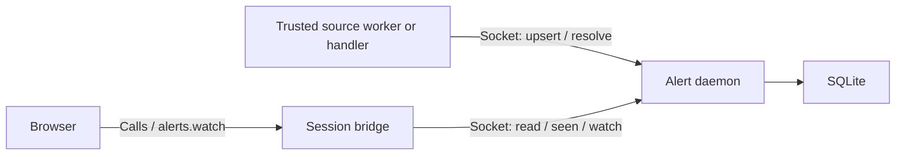

# Alerts and notification delivery

> **Status: Planned.** The server-side alert store, watch Channel, routing, and
> delivery targets are not implemented yet.

This plan defines LinuxIO's durable user-facing alert lifecycle. It deliberately
separates alerts from live Tasks, scheduled-run records, journald logs, transient
toasts, and external delivery. See the
[API reliability roadmap](./api-reliability-roadmap.md) for dependency order and
[Scheduled Execution](./scheduled-execution.md) for timer, run, and log
ownership.

## Domain boundaries

These records answer different questions:

| Record | Question it answers | Authority |
|---|---|---|
| Task | What is this live API operation doing? | `TaskService` or its explicit durable executor |
| Scheduled run | When and how did this timer-triggered execution finish? | systemd plus a bounded LinuxIO run summary |
| Log | What diagnostic output did the executor produce? | journald |
| Alert | What condition currently needs a user's attention? | LinuxIO alert store |
| Delivery attempt | Was an alert transition sent to an external target? | LinuxIO delivery state |

A failed Task or scheduled run may raise an alert, but the alert does not copy
the Task, run, or journal. Ordinary log lines never become alerts merely because
they have warning or error priority.

Sources raise alerts for actionable conditions and selected operation outcomes.
Alert creation is independent of login state, an open browser, and whether a
user or a timer initiated the operation. A manual check and a scheduled check
that discover the same pending update refresh the same logical alert.

Routine saves, validation errors, and deliberate Task cancellations use
immediate UI feedback and Task results. A user-started update that leaves a
managed service broken can also raise a persistent alert for that condition.
Routine successful checks and scheduled runs do not create alerts by default.
Selected success notifications require an explicit source policy.

The same incident can have diagnostic logs, a persistent alert, and a toast
announcing the alert. The UI must avoid duplicate announcements when both the
operation response and the alert watch describe that incident. API operations
keep their normal Call or Task path; no generic API or toast interceptor creates
alerts for them.

## Alert lifecycle

An alert has stable source identity and explicit, independent state:

```text
id, source, category, key
severity (info | warning | error | critical)
title, message, allow-listed metadata
first_occurrence, last_occurrence, occurrence_count, last_observed_at
active, resolved_at (nullable)
dismissed_at/dismissed_by (nullable)
```

`(source, key)` is the deduplication identity. An occurrence is a source-defined
material change, such as a new available release or a different failed run.
Re-observing the same condition updates `last_observed_at`; it does not increment
the occurrence count, reset seen state, restore a dismissed alert, or emit
another delivery event. Retried submissions of the same outcome are idempotent.
Sources identify material changes with stable evidence such as a release
version, image digest, or systemd invocation ID.

A new occurrence updates `last_occurrence` and the count and makes the alert
unseen for its permitted audience. A source resolves the condition only after
confirming it is no longer true. Failed, timed-out, unsupported, or incomplete
checks leave the last confirmed condition intact. Resolution is source truth;
dismissal is a user action and must not masquerade as recovery.

Recurrence after resolution reactivates the same logical alert and starts a new
active occurrence. Recurrence after dismissal follows an explicit source
policy: materially new occurrences restore the alert by default, while noisy
unchanged polling does not.

Seen state is presentation state and is stored per authenticated numeric UID:

```text
alert_id, uid, seen_at (nullable)
```

This lets two users observe the same system condition independently. Dismissal
is initially a privileged system-wide action; if product requirements later
need per-user dismissal, add it as a separate relation rather than overloading
seen state.

Shared host alerts have one condition record and per-user seen state. Seen
state does not grant access: each source must define its permitted audience
before integration. Preserve the corresponding feature's privilege checks and
apply the same visibility rules to lists, watches, and unseen counts.

## Persistence

A standalone root-owned alert daemon owns a small SQLite database for alert
lifecycle, per-user seen state, and delivery attempts. It is shaped like
`linuxio-indexer`: one job, its own sandboxed systemd service, its own database
file, and its own Unix socket, with a client in the bridge. Bridges never open
the database file. The bridge cannot be the owner: it is per session, runs as
the login user, and exits with the session, while sources such as failed
scheduled runs, Docker update failures, and storage health fire with no session
present, and per-user scoping must be enforced by a process the user does not
control. Deduplication, concurrent sessions, independent state transitions, and
bounded queries are relational application semantics; a single-writer daemon
over SQLite is simpler and more honest than rewriting per-user JSON snapshots
or replaying journal history.

Use one host service with systemd socket activation, supervision, and sandboxing.
Trusted source workers can activate it and record alerts without a session.
The daemon owns alert state and subscriptions; systemd timers and short-lived
services own periodic checks. Existing domain services may also report events
as they happen. Source integrations do not require a resident checker daemon
for each feature. Socket activation handles startup; retry work must retain an
execution owner while no clients are connected.

SQLite is not the scheduler or log store. Never persist raw journal output,
every toast, Task progress frames, arbitrary requests, credentials, arbitrary
HTML, or unvalidated external links. Apply schema migrations transactionally,
use restrictive file permissions, enable foreign-key checks, and keep retention
bounded. Active alerts are never removed by age-based pruning.

Phase 6 starts with:

- `alerts` — source identity, lifecycle, severity, safe presentation fields;
- `alert_seen` — per-UID seen timestamp.

Phase 8 adds `delivery_attempts` for target, transition, attempt time, outcome,
and bounded retry state, because delivery is alert state. Scheduled-run
summaries do not live here; the scheduling plan owns them in its own store and
reaches this daemon only as an alert source.

Notification target secrets remain in a separately protected configuration
surface; they do not belong in alert rows or delivery history.

## API

The [API contract](../api-contract.md) defines the browser-to-bridge operation
shapes. Alert routes use the existing Go-owned declarations and generated
frontend types. The daemon exposes a separate private API over its Unix socket;
it does not need a public network endpoint.



Bounded browser requests and mutations are direct Calls:

- `alerts.list` — filtered authoritative snapshot plus revision and unseen
  count;
- `alerts.mark_seen` and `alerts.mark_unseen` — mutate the caller's seen state;
- `alerts.mark_all_seen` — mark the current result set seen;
- `alerts.dismiss` — privileged dismissal of an active alert;
- `alerts.restore` — restore a dismissed alert without pretending its source
  condition changed.

Creation, source updates, and resolution belong to the private source API.
Do not expose `alerts.resolve` as a general browser action. Trusted workers and
privileged handlers submit the same source observation regardless of how the
check or operation started. The daemon applies the peer-credential rules below.

On login or reconnect, the bridge obtains the alerts the user may see, including
that UID's seen state, then keeps the UI synchronized through `alerts.watch`.
The source has already recorded alerts produced while the user was absent.

The public model should use `alert`, not `notification`, for lifecycle APIs.
“Notification” remains the product label for navbar presentation and external
delivery.

## `alerts.watch` Channel

`alerts.watch` is a server-producing Channel. On open it sends an authoritative
snapshot with a monotonically increasing revision, followed by coalesced
revision changes. Reconnect always starts from a current snapshot; correctness
does not depend on replaying every event.

TanStack Query owns the frontend alert cache. The initial list seeds it and the
watch path replaces or invalidates that same cache. Sonner may present newly
visible transitions, but it is never a history owner. Remove the current
localStorage toast history only when the server-backed navbar cuts over.

A slow watcher cannot block alert writes or accumulate an unbounded queue.
Channel closure removes all subscriber resources. The daemon is the single
revision authority: each bridge holds one server-sent-events subscription to
the daemon socket, the same shape as the indexer watch path, and republishes
coalesced revisions to its own Channel subscribers. Bridges do not poll the
database or watch each other.

## Sources

Sources can discover conditions through:

- periodic checks, such as update availability, capacity, or certificate expiry;
- monitored events, such as a managed service failure or UPS state change; and
- selected operation outcomes, such as a failed update, backup, or scheduled run.

Each integration must specify its execution owner and trigger or cadence,
permitted audience, severity, stable key, material-change identity, raise and
resolution conditions, and reconciliation owner. These rules belong to the
source and must not depend on whether the frontend is watching. Monitoring
applies to supported host capabilities and explicitly tracked resources.

### Update availability

The initial sources are in-app alerts. External delivery requires configuration.
Routine availability uses `info`; use a security classification only when the
provider supplies reliable evidence. Acknowledging an update does not install it
or change automatic-installation settings.

| Source | Producer | Raise or update | Resolve |
|---|---|---|---|
| Docker updates | Existing Docker update worker and timer, including `check_only`; manual checks use the same source adapter. | A successful check finds a newer image for a tracked container. Keep one alert per container workload, preserving identity across container replacement. | A successful check confirms the workload is current, or a complete inventory confirms it left the tracked scope. |
| Package updates | A short-lived systemd service invokes the existing package-provider check, daily by default; manual checks share the source adapter. Reuse native repository refresh facilities. | A complete, fresh inventory finds pending updates. Keep one host alert with package and available security-update counts. | A complete, fresh inventory confirms no pending updates. |
| LinuxIO updates | A short-lived systemd service invokes the release checker, daily by default; an explicit manual check uses the same source adapter. | A successful comparison finds a newer applicable LinuxIO release. Keep one host alert and treat a new target version as a material change. | A confirmed installed version satisfies the target release. |

For package alerts, a changed pending-update set can update the summary. The
source must define which changes warrant renewed attention, such as newly
available security updates; a repeated inventory of the same set does not.
Docker image digests and LinuxIO release versions identify new availability.
Manual and scheduled discovery use the same keys. A failed check preserves the
last confirmed availability and records the check failure in source status/logs.
An alert for repeated check failures requires a separate threshold and recovery
policy; it must not masquerade as an availability result.

Current implementation prerequisites:

- Docker already has an unattended check path in
  [scheduled_update_runner.go](../../backend/bridge/handlers/docker/scheduled_update_runner.go).
  Use its persisted observations and configured timer cadence for the first
  integration.
- The Updates page currently requests package availability through the bridge.
  Add the session-independent invocation and define metadata freshness before
  enabling this source. Fix
  [collectUpdatePackages](../../backend/bridge/handlers/packages/updates.go)
  to propagate timeout, transaction-error, and incomplete-result failures before
  using its output to resolve alerts.
- LinuxIO currently checks releases through the browser's `/api/update-info`
  request. Reuse the comparison in
  [version.go](../../backend/webserver/auth/version.go) from a session-independent
  producer without moving authentication or privileged behavior across process
  boundaries. Distinguish a failed/unknown check from a confirmed current version;
  an empty response is not proof that no update exists.

### Further integrations

Add these as their domain owners can meet the source contract:

- Failed or unknown scheduled runs and selected update/backup failures. Key the
  condition by the managed job or resource, and deduplicate each outcome by its
  run/operation identity. A confirmed recovery resolves the condition according
  to that source's policy. The same policy applies to a manual invocation.
- SMART, storage-health, and capacity conditions. Define supported sensors or
  checks, thresholds, and recovery evidence. A user being online does not
  suppress a health alert.
- Failures of systemd units or unhealthy containers that LinuxIO explicitly
  monitors. Deliberate stops and cancellations do not count as failures; retain
  a separate alert if the resulting resource still needs attention.
- Certificate expiry, UPS events, or security conditions once LinuxIO has an
  authoritative integration and a defined audience for them.

Routine successful runs remain in run history. Selected success notifications
are optional later behavior, with an explicit source and delivery policy.

### Submission and reconciliation

Task or run completion remains authoritative if alert persistence fails. Source
owners persist the authoritative outcome before submitting an idempotent alert
update. Their reconciliation service retries from the existing outcome record
or re-observes the condition; it must not execute the original action again.
Use a short-lived systemd service and timer where the domain has no existing
reconciliation owner. Define the retry cadence and bounded work per pass in the
integration. No live bridge is required for retries or unknown-run detection.

For scheduled runs, reconciliation belongs to the scheduling implementation;
bridge-on-read reconciliation alone is insufficient for unattended alerts.
Delivery retries after a committed alert belong to the alert delivery layer.
Frontend Task recovery and toast history never manufacture alerts.

### Implementation order

Prove the core and navbar with Docker's existing check-only path, including
creation with no session, login/reconnect, deduplication, and recovery. Package
and LinuxIO release sources follow once their unattended invocation and result
semantics are ready. Generic scheduled execution is a dependency only for its
own run alerts; other sources and external delivery need the alert core, not the
generic scheduling feature.

## Routing and delivery

External delivery is a later layer inspired by Proxmox's
event/matcher/target split:

1. An alert transition emits a delivery event containing severity, source,
   type, timestamp, and allow-listed metadata.
2. Matchers select events by severity and metadata. Calendar rules are added
   only when users need quiet hours or time-based routing.
3. Targets deliver through email, webhook, or another explicitly supported
   adapter.

Each target receives one delivery per matched transition even if multiple
matchers select it. Frequency, grouping, and retry policy belong here, not in
the alert lifecycle. Delivery failure may itself be surfaced as a bounded
administrative alert without recursively routing forever.

Login state controls immediate UI presentation, not source eligibility or
external delivery. Repeated observations of an unchanged condition do not
generate deliveries. Routine update alerts stay in-app unless users configure a
target; a digest can be added when users need grouped delivery.

## Security and failure behavior

- The daemon socket is connectable by unprivileged bridges, unlike the
  root-only indexer socket, because unprivileged sessions read alerts. The
  kernel peer credential is the authority: a peer is the UID it connected as.
  A root peer serves several sessions and may assert the session UID for
  seen-state operations; every other peer is scoped to its own UID and the
  bridge cannot widen that.
- Every read and seen-state mutation is scoped to that UID and the source's
  permitted audience. Apply the same checks to snapshots, watches, and counts.
- Only root peers, meaning system units and root bridges, may create, update,
  or resolve alerts. Dismiss/restore and target configuration also require a
  root peer. Alerts raised by unprivileged sessions are out of the initial
  scope; add them as a separate UID-owned relation if a product need appears.
- Alert metadata and internal routes are allow-listed and length-bounded.
- Database busy, full, migration, permission, and decode failures surface with
  operation context and never publish an uncommitted revision.
- A source outcome is not rolled back when alert creation or delivery fails.
- Retention removes only resolved alerts allowed by policy and old delivery
  attempts; active alerts are preserved. Run-summary retention belongs to the
  scheduling plan.

## Initial completion criteria

- The database schema and migrations have crash and concurrent-session tests.
- Deduplication, recurrence, resolution, seen, dismissal, and restoration each
  have explicit transition tests.
- Manual and scheduled checks of the same condition produce one logical alert.
- Unchanged observations preserve occurrence count, seen state, dismissal, and
  delivery state; material changes follow the source's recurrence policy.
- Failed or incomplete checks cannot resolve an availability alert.
- The first source records and reconciles alerts without a logged-in session.
  A later login receives those alerts with authorized per-UID seen state.
- Routine interaction feedback creates no alerts; an actionable condition can
  raise an alert during an interactive session.
- Reconnect obtains a complete snapshot before live changes.
- Source visibility rules cover list, watch, unseen count, and lifecycle access.
- The navbar has one server state owner and no local persistent history owner.
- No logs or progress frames are copied into the alert database.
- Routing and delivery remain a separate later slice unless the local lifecycle
  is already proven.

## Reference behavior

- [TrueNAS alert settings](https://www.truenas.com/docs/scale/25.10/scaleuireference/systemsettings/alertssettingsservicescreen/)
  cover storage, updates, certificates, task outcomes, and UPS conditions.
- [Synology Task Scheduler](https://kb.synology.com/en-global/DSM/help/DSM/AdminCenter/system_taskscheduler?version=7)
  supports outcome emails for scheduled and triggered scripts, including a
  failure-only option.
- [Unraid notification settings](https://docs.unraid.net/unraid-os/getting-started/set-up-unraid/customize-unraid-settings/#notification-settings)
  separate update/system/array sources from browser, email, and agent delivery.
